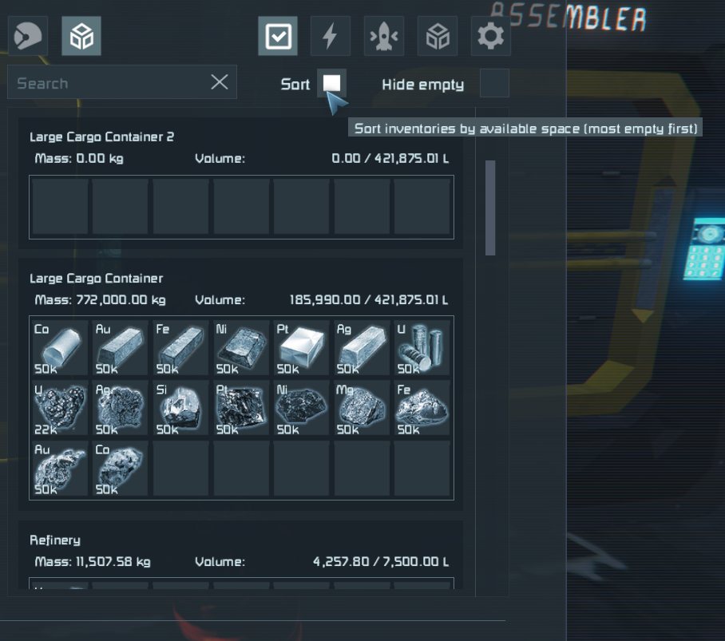

# Sort by Available Cargo

A Space Engineers client plugin (Pulsar) that adds inventory sorting to the terminal UI. Sort containers by remaining free cargo space so the most-empty inventories appear first — find where to drop off scrap in seconds.



## Features

- **Sort by Available Cargo**: Containers are sorted by `MaxVolume - CurrentVolume`, so the most-empty inventories rise to the top.
- **In-UI toggle**: A Sort checkbox sits right next to the existing "Hide Empty" checkbox on the right inventory panel — no need to open a settings dialog.
- **Smart visibility**: The Sort checkbox hides itself when the character/suit filter is active (mirrors how "Hide Empty" behaves — only one inventory means nothing to sort).
- **Right-panel only by default**: Production blocks (left panel) keep the original alphabetical order. Optional toggle in plugin settings if you want both panels sorted.
- **Tooltip on hover**: Hover the Sort checkbox to read a one-liner explaining what it does.
- **Persists across sessions**: Your on/off state survives game restarts.
- **Enabled by default**: Sorting is ON out of the box — works the first time you open the terminal.

## Installation

1. Install [Pulsar](https://github.com/SpaceGT/Pulsar).
2. Enable this plugin (`Sort by Available Cargo`) in the Pulsar profile editor (`Profiles\Current.xml` for both `Legacy` and `Interim` editions).
3. DLL + descriptor XML are auto-deployed by the project's `Deploy.bat` when built with `dotnet build` (Pulsar must be closed for the copy to succeed).

## Usage

1. Open any terminal (ship/station inventory).
2. Switch to the grid filter (the cube icon, not the character icon).
3. Tick the **Sort** checkbox next to **Hide Empty** on the right panel.
4. The inventory list reorders so emptier containers come first.

State is remembered per-user and restored next session.

## Settings (plugin settings dialog)

| Option | Default | Effect |
|---|---|---|
| `SortByAvailableSpace` | ON | Master switch for inventory sorting. |
| `SortLeftPanelToo` | OFF | Also sort the left (production) panel. Off by default because production blocks usually have items in progress. |
| `KeepActiveContainerFirst` | ON | When ON (vanilla behavior), the currently opened container is pinned to the top of the sorted list even if it isn't the most empty. Turn OFF to apply sorting to every container including the active one — then the active container is ordered by available space just like the others. Only takes effect when `SortByAvailableSpace` is ON. |

## How It Works

Harmony patches three methods on `MyTerminalInventoryController`:

1. `CreateInventoryPageRightSection` — adds a Sort checkbox + label to the right tab page. Shrinks the search box so the Sort controls fit between it and "Hide Empty".
2. `CreateInventoryControlsInList` — caches the currently-focused owner before the sort runs and identifies which panel is being sorted. Cleared afterwards.
3. `CompareGuiControlInventoryOwners` — replaces the comparison function with one that ranks by available space when the Sort toggle is on and the panel being sorted is allowed by config.

Available space is computed via reflection on `MyInventory.MaxVolume` / `MyInventory.CurrentVolume`. `MyFixedPoint` (the volume unit) is converted through its `RawValue` long field divided by 1,000,000.

## Building

```bash
dotnet build SortAvailableCargo.sln
```

DLL + descriptor XML are auto-deployed to `%AppData%\Pulsar\Legacy\Local` and `%AppData%\Pulsar\Interim\Local` by the project's MSBuild targets (game must be closed).

## Compatibility

- Space Engineers 1.210.x
- Pulsar (Legacy net48 + Interim net10.0)
- Should be neutral to other inventory plugins (`BetterInventorySearch`, `Assembler Sorting`, etc.) — the Sort checkbox is just another control on the same page.

## Known Limitations

- The Sort checkbox lives on the right inventory page only. The left (production) panel can be sorted via the `SortLeftPanelToo` config flag, but there is no checkbox on the left side.
- Multi-inventory containers (refineries, assemblers, survival kits) sum the available space across all their inventories.

## License

MIT
